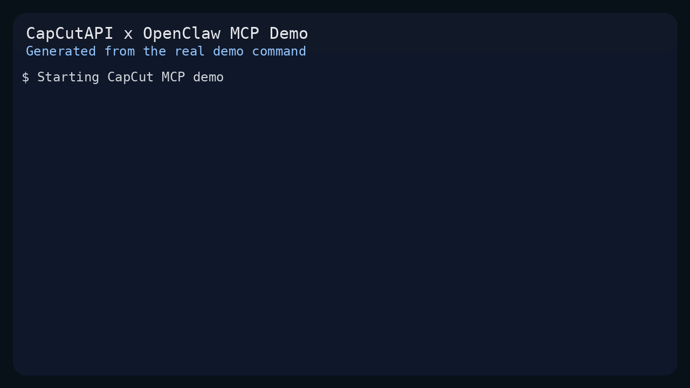

# 🎬 CapCutAPI - Open source CapCut API tool.

<div align="center">


[](https://github.com/sun-guannan/CapCutAPI/stargazers)
[](LICENSE)
[](https://python.org)
[](./MCP_Documentation_English.md)

**🚀 Open source CapCut API tool with MCP (Model Context Protocol) support**

[🌐 Try Online](https://www.capcutapi.top) • [📖 中文文档](README-zh.md) • [🔧 MCP Docs](./MCP_Documentation_English.md) • [🌍 MCP 中文指南](./MCP_文档_中文.md)

</div>

---

## 🎯 Project Overview

**CapCutAPI** is a powerful enterprise-grade video editing automation platform built with Python, providing complete CapCut video editing capabilities. Through dual interfaces of HTTP API and MCP protocol, it enables seamless integration with AI assistants and automation tools.

### 🏆 Core Advantages

<table>
<tr>
<td width="50%">

**🎬 Professional Video Editing**
- Complete CapCut functionality support
- Multi-track timeline editing
- Advanced effects and transitions
- Keyframe animation system

</td>
<td width="50%">

**🤖 AI Smart Integration**
- Native MCP protocol support
- Seamless AI assistant integration
- Automated workflow processes
- Batch processing capabilities

</td>
</tr>
<tr>
<td>

**🔌 Dual API Interfaces**
- RESTful HTTP API
- Model Context Protocol
- Real-time processing response
- Enterprise-grade stability

</td>
<td>

**🌍 Cross-platform Compatibility**
- CapCut International support
- JianYing China support
- Windows/macOS compatible
- Cloud deployment ready

</td>
</tr>
</table>

---

## 🎥 Product Showcase

<div align="center">

### 🐎 AI Generated Video Cases

[](https://www.youtube.com/watch?v=IF1RDFGOtEU)

### 🎵 Music Video Production

[](https://www.youtube.com/watch?v=rGNLE_slAJ8)

*AI-driven video generation powered by CapCutAPI*

</div>

---

## Demo: OpenClaw MCP Flow

This repository now includes a reproducible OpenClaw-focused MCP demo that exercises the real `create_draft -> add_text -> save_draft` flow and stores the generated draft locally.



### Run the demo

```bash
./.venv/bin/python demo/run_mcp_demo.py
```

The script:

- starts `mcp_server.py`
- initializes an MCP client
- creates a portrait draft
- adds styled text with shadow, background, and multi-style ranges
- saves the generated draft under `demo/output/<draft_id>`

### Regenerate the GIF used in this README

```bash
./.venv/bin/python demo/render_demo_gif.py
```

This command reruns the live demo and converts the terminal output into `docs/demo/capcut-openclaw-demo.gif`.

---

## 🚀 Core Features

### 📋 Feature Matrix

| Feature Module | HTTP API | MCP Protocol | Description |
|---------------|----------|--------------|-------------|
| 🎬 **Draft Management** | ✅ | ✅ | Create, read, modify, save CapCut draft files |
| 🎥 **Video Processing** | ✅ | ✅ | Multi-format video import, editing, transitions, effects |
| 🔊 **Audio Editing** | ✅ | ✅ | Audio tracks, volume control, audio effects |
| 🖼️ **Image Processing** | ✅ | ✅ | Image import, animations, masks, filters |
| 📝 **Text Editing** | ✅ | ✅ | Multi-style text, shadows, backgrounds, animations |
| 📄 **Subtitle System** | ✅ | ✅ | SRT subtitle import, styling, time sync |
| ✨ **Effects Engine** | ✅ | ✅ | Visual effects, filters, transition animations |
| 🎭 **Sticker System** | ✅ | ✅ | Sticker assets, position control, animation effects |
| 🎯 **Keyframes** | ✅ | ✅ | Property animations, timeline control, easing functions |
| 📊 **Media Analysis** | ✅ | ✅ | Video duration detection, format analysis |

### 🛠️ API Interface Overview

<details>
<summary><b>📡 HTTP API Endpoints (9 endpoints)</b></summary>

🎬 Draft Management
├── POST /create_draft     # Create new draft
└── POST /save_draft       # Save draft file

🎥 Media Assets
├── POST /add_video        # Add video material
├── POST /add_audio        # Add audio material
└── POST /add_image        # Add image material

📝 Text Content
├── POST /add_text         # Add text elements
└── POST /add_subtitle     # Add subtitle files

✨ Effect Enhancement
├── POST /add_effect       # Add visual effects
└── POST /add_sticker      # Add sticker elements


</details>

<details>
<summary><b>🔧 MCP Tool Set (11 tools)</b></summary>

🎬 Project Management
├── create_draft           # Create video project
└── save_draft             # Save project file

🎥 Media Editing
├── add_video              # Video track + transition effects
├── add_audio              # Audio track + volume control
└── add_image              # Image assets + animation effects

📝 Text System
├── add_text               # Multi-style text + shadow background
└── add_subtitle           # SRT subtitles + styling

✨ Advanced Features
├── add_effect             # Visual effects engine
├── add_sticker            # Sticker animation system
├── add_video_keyframe     # Keyframe animations
└── get_video_duration     # Media information retrieval

</details>

---

## 🛠️ Quick Start

### 📋 System Requirements

<table>
<tr>
<td width="30%"><b>🐍 Python Environment</b></td>
<td>Python 3.8.20+ (Recommended 3.10+)</td>
</tr>
<tr>
<td><b>🎬 CapCut Application</b></td>
<td>CapCut International or JianYing China</td>
</tr>
<tr>
<td><b>🎵 FFmpeg</b></td>
<td>For media file processing and analysis</td>
</tr>
<tr>
<td><b>💾 Storage Space</b></td>
<td>At least 2GB available space</td>
</tr>
</table>

### ⚡ One-Click Installation

```bash
# 1. Clone the project
git clone https://github.com/sun-guannan/CapCutAPI.git
cd CapCutAPI

# 2. Create virtual environment (recommended)
python -m venv venv-capcut
source venv-capcut/bin/activate  # Linux/macOS
# or venv-capcut\Scripts\activate  # Windows

# 3. Install dependencies
pip install -r requirements.txt      # HTTP API basic dependencies
pip install -r requirements-mcp.txt  # MCP protocol support (optional)

# 4. Configuration
cp config.json.example config.json
# Edit config.json as needed
```

### 🚀 Start Services

<table>
<tr>
<td width="50%">

**🌐 HTTP API Server**

```bash
python capcut_server.py
```

*Default port: 9001*

</td>
<td width="50%">

**🔧 MCP Protocol Server**

```bash
python mcp_server.py
```

*Supports stdio communication*

</td>
</tr>
</table>

---

## 🔧 MCP Integration Guide

### 📱 Client Configuration

Create or update `mcp_config.json` configuration file:

```json
{
  "mcpServers": {
    "capcut-api": {
      "command": "python3",
      "args": ["mcp_server.py"],
      "cwd": "/path/to/CapCutAPI",
      "env": {
        "PYTHONPATH": "/path/to/CapCutAPI",
        "DEBUG": "0"
      }
    }
  }
}
```

### 🧪 Connection Testing

```bash
# Test MCP connection
python test_mcp_client.py

# Expected output
✅ MCP server started successfully
✅ Retrieved 11 available tools
✅ Draft creation test passed
```

### 🎯 MCP Featured Functions

<div align="center">

| Feature | Description | Example |
|---------|-------------|----------|
| 🎨 **Advanced Text Styling** | Multi-color, shadow, background effects | `shadow_enabled: true` |
| 🎬 **Keyframe Animation** | Position, scale, opacity animations | `property_types: ["scale_x", "alpha"]` |
| 🔊 **Audio Precision Control** | Volume, speed, audio effects | `volume: 0.8, speed: 1.2` |
| 📱 **Multi-format Support** | Various video dimensions and formats | `width: 1080, height: 1920` |
| ⚡ **Real-time Processing** | Instant draft updates and previews | Millisecond response time |

</div>

---

## 💡 Usage Examples

### 🌐 HTTP API Examples

<details>
<summary><b>📹 Adding Video Material</b></summary>

```python
import requests

# Add background video
response = requests.post("http://localhost:9001/add_video", json={
    "video_url": "https://example.com/background.mp4",
    "start": 0,
    "end": 10,
    "width": 1080,
    "height": 1920,
    "volume": 0.8,
    "transition": "fade_in"
})

print(f"Video addition result: {response.json()}")
```

</details>

<details>
<summary><b>📝 Creating Styled Text</b></summary>

```python
import requests

# Add title text
response = requests.post("http://localhost:9001/add_text", json={
    "text": "🎬 Welcome to CapCutAPI",
    "start": 0,
    "end": 5,
    "font": "Arial",
    "font_color": "#FFD700",
    "font_size": 48,
    "shadow_enabled": True,
    "background_color": "#000000"
})

print(f"Text addition result: {response.json()}")
```

</details>

### 🔧 MCP Protocol Examples

<details>
<summary><b>🎯 Complete Workflow</b></summary>

```python
# 1. Create new project
draft = mcp_client.call_tool("create_draft", {
    "width": 1080,
    "height": 1920
})
draft_id = draft["result"]["draft_id"]

# 2. Add background video
mcp_client.call_tool("add_video", {
    "video_url": "https://example.com/bg.mp4",
    "draft_id": draft_id,
    "start": 0,
    "end": 10,
    "volume": 0.6
})

# 3. Add title text
mcp_client.call_tool("add_text", {
    "text": "AI-Driven Video Production",
    "draft_id": draft_id,
    "start": 1,
    "end": 6,
    "font_size": 56,
    "shadow_enabled": True,
    "background_color": "#1E1E1E"
})

# 4. Add keyframe animation
mcp_client.call_tool("add_video_keyframe", {
    "draft_id": draft_id,
    "track_name": "main",
    "property_types": ["scale_x", "scale_y", "alpha"],
    "times": [0, 2, 4],
    "values": ["1.0", "1.2", "0.8"]
})

# 5. Save project
result = mcp_client.call_tool("save_draft", {
    "draft_id": draft_id
})
print(f"Project saved: {result['result']['draft_url']}")
```

</details>

### Testing with REST Client

You can use the `rest_client_test.http` file with REST Client IDE plugins for HTTP testing.

### Draft Management

Calling `save_draft` generates a folder starting with `dfd_` in the server's current directory. Copy this folder to your CapCut draft directory to access the generated draft in CapCut.

---

## 📚 Documentation Center

<div align="center">

| 📖 Document Type | 🌍 Language | 📄 Link | 📝 Description |
|-----------------|-------------|---------|----------------|
| **MCP Complete Guide** | 🇺🇸 English | [MCP Documentation](./MCP_Documentation_English.md) | Complete MCP server usage guide |
| **MCP User Manual** | 🇨🇳 Chinese | [MCP 中文文档](./MCP_文档_中文.md) | Detailed Chinese usage instructions |
| **API Reference** | 🇺🇸 English | [example.py](./example.py) | Code examples and best practices |
| **REST Testing** | 🌐 Universal | [rest_client_test.http](./rest_client_test.http) | HTTP interface test cases |

</div>

---

## 🌟 Enterprise Features

### 🔒 Security

- **🛡️ Input Validation**: Strict parameter validation and type checking
- **🔐 Error Handling**: Comprehensive exception catching and error reporting
- **📊 Logging**: Detailed operation logs and debug information
- **🚫 Resource Limits**: Memory and processing time limit protection

### ⚡ Performance Optimization

- **🚀 Async Processing**: Non-blocking concurrent operation support
- **💾 Memory Management**: Smart resource recycling and caching mechanisms
- **📈 Batch Processing**: Efficient batch operation interfaces
- **⏱️ Response Time**: Millisecond-level API response speed

### 🔧 Scalability

- **🔌 Plugin Architecture**: Modular functionality extension support
- **🌐 Multi-protocol**: HTTP REST and MCP dual protocol support
- **☁️ Cloud Deployment**: Containerization and microservice architecture ready
- **📊 Monitoring Integration**: Complete performance monitoring and metrics collection

---

## 🤝 Community & Support

### 💬 Get Help

<div align="center">

| 📞 Support Channel | 🔗 Link | 📝 Description |
|-------------------|---------|----------------|
| **🐛 Bug Reports** | [GitHub Issues](https://github.com/sun-guannan/CapCutAPI/issues) | Bug reports and feature requests |
| **💡 Feature Suggestions** | [Discussions](https://github.com/sun-guannan/CapCutAPI/discussions) | Community discussions and suggestions |
| **📖 Documentation Feedback** | [Documentation Issues](https://github.com/sun-guannan/CapCutAPI/issues?q=label%3Adocumentation) | Documentation improvement suggestions |
| **🔧 Technical Support** | [Stack Overflow](https://stackoverflow.com/questions/tagged/capcut-api) | Technical Q&A |

</div>

### 🎯 Contributing Guide

We welcome all forms of contributions!

```bash
# 1. Fork the project
git clone https://github.com/your-username/CapCutAPI.git

# 2. Create feature branch
git checkout -b feature/amazing-feature

# 3. Commit changes
git commit -m 'Add amazing feature'

# 4. Push branch
git push origin feature/amazing-feature

# 5. Create Pull Request
```

---

## 📈 Project Statistics

<div align="center">

### ⭐ Star History

[](https://www.star-history.com/#sun-guannan/CapCutAPI&Date)

### 📊 Project Metrics


</div>

---

## 📄 License

<div align="center">

This project is open source under the Apache 2.0 License. See [LICENSE](LICENSE) file for details.

Apache License 2.0

Copyright (c) 2025 CapCutAPI Contributors

Licensed under the Apache License, Version 2.0 (the "License");
you may not use this file except in compliance with the License.
You may obtain a copy of the License at

    http://www.apache.org/licenses/LICENSE-2.0

Unless required by applicable law or agreed to in writing, software
distributed under the License is distributed on an "AS IS" BASIS,
WITHOUT WARRANTIES OR CONDITIONS OF ANY KIND, either express or implied.
See the License for the specific language governing permissions and
limitations under the License.

</div>

---

<div align="center">

## 🎉 Get Started Now

**Experience the power of CapCutAPI today!**

[](https://www.capcutapi.top)
[](https://github.com/sun-guannan/CapCutAPI/archive/refs/heads/main.zip)
[](./MCP_Documentation_English.md)

---

**🆕 New Feature**: Now with MCP protocol support for seamless AI assistant integration! Try the MCP server for advanced video editing automation.

*Made with ❤️ by the CapCutAPI Community*

</div>
